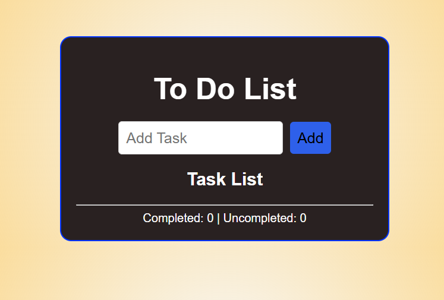
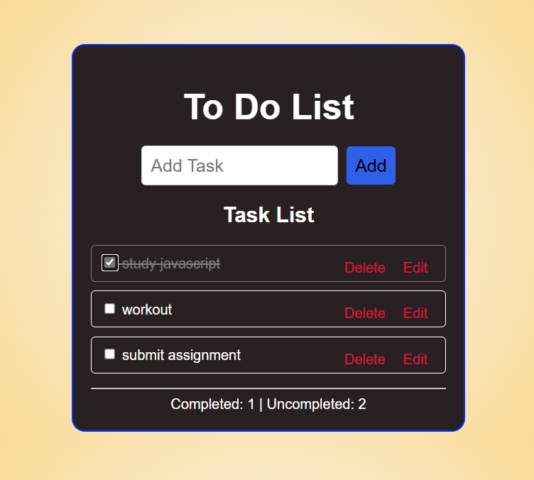
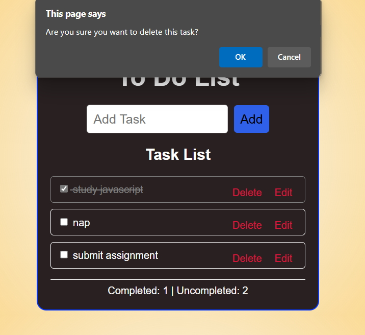
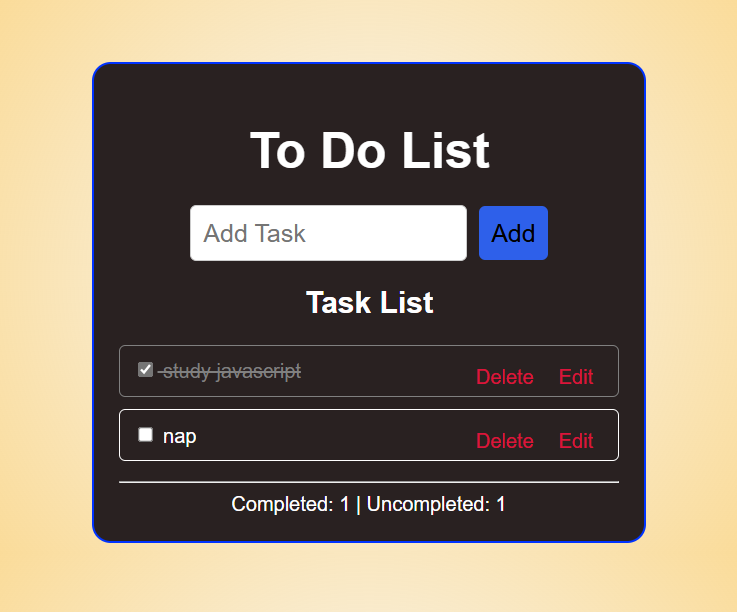

# 📝 Simple To-Do List

This is a basic and stylish To-Do List web application built with **HTML**, **CSS**, and **JavaScript**. It allows users to add, edit, complete, and delete tasks with live counters for completed and uncompleted tasks.

------

## 🚀 Features

- ✅ Add new tasks
  
- ✏️ Edit existing tasks
  
- ❌ Delete tasks
  
- 📌 Mark tasks as completed
  
- 📊 View real-time counters for completed and uncompleted tasks
  
- 🎨 Clean and responsive UI with custom CSS

------

## 📂 Project Structure

to-do-list/

│

├── index.html # Main HTML structure

├── style.css # Styling for the to-do list

└── script.js # JavaScript functionality

------

## 📸 Screenshots

1. **Main View**
   
   

2. **With Tasks**
   
   

3. **Edit Task**

   

4. **Delete Task**
   
   

   

------

## 🛠️ How to Use

1. Clone or Download the project.
   
2. Open the index.html file in your browser.
   
3. Add tasks using the input field and **Add** button.
   
4. Mark them as completed, edit, or delete as needed.

------

## 📋 Example Task Entry Flow

- Type in the input box.
  
- Click Add.
  
- Click the checkbox to mark as done.
  
- Use Edit or Delete to modify the task.
   
